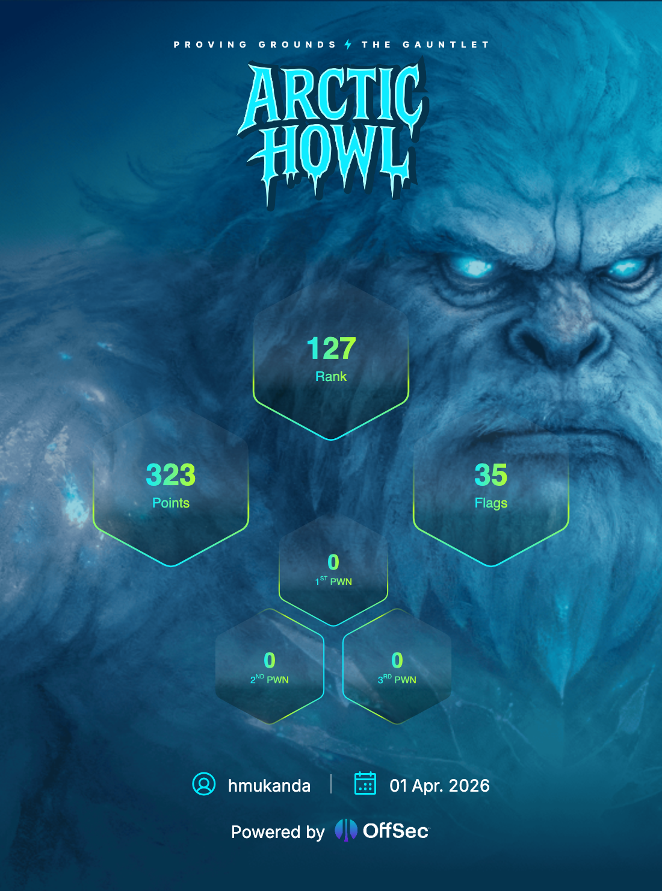

# The Gauntlet: Arctic Howl

## OffSec CTF Event

---

## Event Description

The Cascade Expanse is no longer ruled by instinct alone. Ashka, an Arctic Wolf, was among the greatest cybersecurity hunters the Expanse had ever known — defending the Tundra Realm through instinct, reading subtle signals, sensing danger, and striking before threats could surface. When unusual activity rippled through the Tundra data center, Ashka moved to investigate but the adversary was already there. Two steps ahead. From the shadows, Ashka was struck down and taken. When the alarms faded, she was gone. Her disappearance marked the beginning of a far greater threat.

Throughout this Gauntlet season, challengers face an evolving adversary in a frozen cybersecurity battleground. Across increasingly difficult labs, competitors must adapt, learn, and outthink threats designed to punish stagnation and reward growth. As the season unfolds, challengers uncover the truth behind a missing guardian, a calculating adversary, and a chilling experiment that seeks to reshape instinct itself — blurring the line between hunter and machine. Only those who adapt will survive. Only those who endure will uncover the truth. And only the strongest will reach the heart of the storm.

Welcome to Arctic Howl.

---

## My Participation

**Operator:** Howard (lmakonem)

Across four icy Grimoires in The Gauntlet: Arctic Howl, I pushed through shifting terrain, rising pressure, and a leaderboard that never stopped moving. Every challenge demanded adaptation — from browser exploit forensics and malware analysis to insider threat investigation — requiring relentless application of offensive security fundamentals.

### Season Stats

---

## Challenges

| # | Challenge | Difficulty | Points | Status |
|---|-----------|------------|--------|--------|
| 1 | [Cold Access](Cold-Access/README.md) | Medium | — | Completed (10/10) |
| 2 | [Expanse Surveyor](Expanse-Surveyor/README.md) | Medium | — | Completed |
| 3 | [Trusted Trouble](Trusted-Trouble/README.md) | Hard | 80 | Completed (8/8) |

---

## Challenge Summaries

### Cold Access
Network forensics investigation into a browser-based initial access event targeting the Cascade NGO Hub. Analysis of a PCAP capture revealed a spear-phishing email delivering a **CVE-2024-5830** V8 type confusion exploit via a malicious webpage. The multi-stage exploit chain included a heap sandbox escape via DOMRect/AudioBuffer confusion and JIT-sprayed x86-64 shellcode that executed `ping db` as a proof-of-execution callback.

**Key skills:** PCAP analysis, V8 exploit archaeology, shellcode disassembly, browser exploit understanding

---

### Expanse Surveyor
Android malware analysis and network traffic investigation. A suspicious APK (`gallery-17-gplay-release.apk`) was installed on a researcher's device and began making anomalous outbound connections. Analysis involved decompiling the APK with jadx, identifying malicious behaviour, and correlating with a large HAR network capture to understand C2 communication patterns.

**Key skills:** Android APK reverse engineering, HAR traffic analysis, malware behaviour analysis, Protocol Buffer decoding

---

### Trusted Trouble
Multi-source PCAP investigation into a data breach at Megacorp One following a new employee intake. Analysis of MAIL server and CLIENT machine captures uncovered the full insider threat timeline: 9 applicants, 3 hired, one VPN issue, two policy violators, and one insider who exfiltrated a SQLite credentials database (`sensitive.db`) containing plaintext credentials to an external C2 at `203.98.112.47`.

**Insider threat identified:** Samuel Adu
**Exfiltrated data:** Robin Schwartz / `5up3r5Tr0NgP@$$w0rd!`

**Key skills:** PCAP analysis, insider threat investigation, email forensics, SQLite extraction, network exfiltration detection

---

## Season Reflection

Arctic Howl was a well-constructed gauntlet that progressively escalated in complexity — from a single-source browser exploit PCAP, to multi-source correlated network investigations. The season rewarded methodical analysis over speed: each challenge layered new context that required going back to earlier evidence with fresh eyes.

The final challenge, Trusted Trouble, was the most satisfying — the full insider threat story only emerged by correlating mail server and client captures together, something that wouldn't have been visible from any single data source alone.

---

*OffSec The Gauntlet: Arctic Howl — Season Complete*
